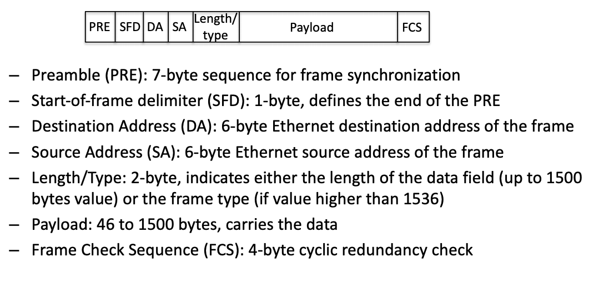

# Metro Core Networks

## class notes

Network terminated - Electronic core connects E-XC

IP topology built on top of E-XC links

The pre-existing infrastructure of the internet was the left over phone network.

Packet switching: bunch of transmission lines and send packets one after the other.

VOIP: voice over IP

### IP over WDM

Remove OXC and use routers to terminate all traffic

No need for L2 network as the IP transmits directly on top of WDM network.

Problem: All traffic is terminated in the router meaning it need a dedicated port. Core Routers are very expensive though.

Also wasting switches cause we know where the packet is going

### Second generation optical networks

Dynamic switching of paths i.e routing at the optical level.

Optical cross connect is the optical element that provides switching.

Traffic leaving the network can be terminated at a router. The rest can be routed on at the optical layer with multiplexers.

Problem: Everything is fixed, the routes always go the same way. To add more capacity you need to physically adjust the multiplexer connections.

Fix: teh ability to electronically reconfigure the device to decide where the connections go.

Degree denotes the direction i.e 2 degree is bi-directional. It goes two directions. 3 degrees means three directions etc.

Advantages: Route optical channel without multiplexing.

### Optical cross connects

Fibre switch: come in with a number of fibres and leave with a number of fibres. Simple device. micro mirrors tilt in various directions, this directing the signal.

Bean Steering: Lens on top of the beam and steer the beam.

These must be accurate

WSS: All the wavelengths come in to a reconfigurable device which can decide which port to export a wavelength at.

### New issues

Optical layer is analog

* new path could be longer and have a lower OSNR. dynamic switching
* Adding.Removing wavelength channels create power excursion in teh amplifier chains that generate errors in all other channels.

Independent operating of layers can cause issues. Such as convergence issues

Fibre topology usually becomes the static topology. Have to dig up the ground to lay fibre.

Congestion can become an issue on a ditributed network as one change causes chaen everywhere that's unoredictable

### MPLS

Centralised switching that works on a global network.

Header: focus on the label: used for packet switching.

the label identifies a virtual path and it only has a local meaning e.g between two adjacent MPLS switches.

Taking all the possible flows and deciding where they go.

Label distribution protocol: the exchange of labels and agreement on wat should be used. Switching table has teh incoing label and the port it comes in at and then replces the label with an utgoing label and sends it puot the crrect port.

at the edge of the network you have to add and remoe the MPLS label respectively. Thus convering from ip to MPLS and vice versa.

Label stacking: The idea of creating nested tunnels.

### Forwarding Equivalence class(FEC)

Putting in the first label of a packet, one coming from IP.

What is the mapping between fieds in the UP header and the label tat the packet receives.

There are many possible criteria for the mapping e.g Destination of IP address.

Problem: Advancements in ASIC and T-CAM memories IP routing culd be done fast (at line rate) so the speed advantage of MPLS became obsolete.

T-CAM: special memories in your router. Look through and entire address space in one clock cycle.

## Personal Notes

Develop from the core as it is the point at which users data is aggregated

Metro networkcalled aggregation as it aggregate the users data from the access networks.

Data from the metro does not need to reach the core: try to keep it local if possible.

CDN will carry more than 71 percent of user traffic by 2021.

Access networks are point to point but metro and core are mesh networks.

IP topology was built on top of E-XC

### IP over WDM

remove OXC and use routers to terminate all traffic.

Ip would transmit directly on top of WDM network

COnsidered when all information started to be transmitted over ip

Problem is that all traffic is terminated and each fibre needs a port in the router and routers are very expensive.

### Second gen optical networks

Dynamic switching of the paths taken at the optical layer of the network

Optical cross connects is the element that provides the switching

Entire optical switching element often referred to as ROADM

ROADM also used to connect L2 networks

* No need for optical electrical conversion
* big savings
* lower energy consumption

only applies to channels that don't need to operate add/dropping

*Optical Cross connects*

Multiple means of implementation

* Fibre switch: connects signals from entire fibres (MEMs, eam steering)
  * Think about steering light through the use of mirrors or via beam steering
* Wavelength Selective Switching(WSS)

Problems:

* OSNR needs to be considered as since the paths are dynamic they can have different OSNRs and some of these may not work.
* Adding/dropping wavelength channels creates power excursion in the amplifier chains that generate errors in all other channels.
* It is difficult to predict how the non-linear effect will impact the system after switching.
* The separation of the layers can cause convergence issues in path calculation. For example if the IP layer calculates a new route but then the optical layer changes than the paths that are to be used differ and will take time to converge, creating instability.
* The operator has more freedom to decide the routes taken on multiple layers but the multiple layers increases the complexity of the determinations.

### MPLS

transport protocol sitting at layer 2.5, can also be used to transport ethernet. Why? imagine a stacker ethernet layer above MPLS as a servce sold to a customer and it is separate to the ethernet of L2

Header:

* Label: bits 0..19 for packet switching
* Traffic Class: bits 20..22 class assignment for flow (QoS)
* Bottom of Stack: bit 23 indicates where the label sits in the stack. 1 for bottom of stack
* Time to Live (TTl): bits 24-31

The label replaced IP and is a local virtual path to be taken.

Use a label distribution algorithm that gives each switch a label for flow.

So when a packet arrives a MPLS switch reads the label, performs a table lookup, and finds the port it should send the label out of. performs pop and push of old and new label.

Ingress from IP: Forward equivalence class (FEC) performs mapping between IP and MPLS path

Egress to IP: opposite of ingress

Can have nested tunnels where a pop operation is not performed and another MPLS label is pushed on top of the previous one. Separate MPLS networks controlled by different entities.

MPLS is a centralised routing protocol: moving away from the distributed routing protocols of old

A packet can be mapped to a particular FEC for the following:

* Destination IP address
* Source IP address
* TCP/UDP address
* In case of inter-AS MPLS, source-AS, Dest-AS
* Class of service
* Application used

Advancements in ASIC and T-CAM have made IP switching at line rate possible and thus MPLS is obsolete.

### Ethernet

Moving from LAN to Metro and Core networks

Works off of a switching table with a star topology

Initially the table is empty, port A sends a message for C, the switch sees teh source and destination of the message from As port. The table is empty so the switch sends the message to every port bar A.

The table is updated for A,

As messages come in from the other ports the table will be updated.

### Virtual LAN (VLAN)

Multiple independent sub-networks built on top of the same infrastructure

defined in the 802.1Q standard

Adds a VLAN header to the ethernet frame

* 4-bytes in size
* first two bytes indicate it's a VLAN frame - 0x8100
* Next two bytes are the VLAN ID (12 bits), 1 bit flag and 3 bit priority
* 12 bits means 4096 separate VLANs

### Carrier Ethernet

802.1ad (Q-in-Q)adds a new tag to the ethernet header

The carriers has it's own VLAN header as well as the customer VLAN header

The carrier will add their tag when the packet arrives from a customer network and remove it when it reaches the destination customer network. C-VID and S-VID

This can stack as a switch can operate over the first tag that it sees.

### Acronyms

E-XC: Electronic Cross connects
ROADM: Reconfigurable optical Add Drop Multiplexer
WSS: Wavelength Selective Switching
OSNR: Optical Signal to Noise ratio
MPLS: Multi-Protocol Label Switching
TTL: Time To Live
FEC: Forward Equivalence Class
